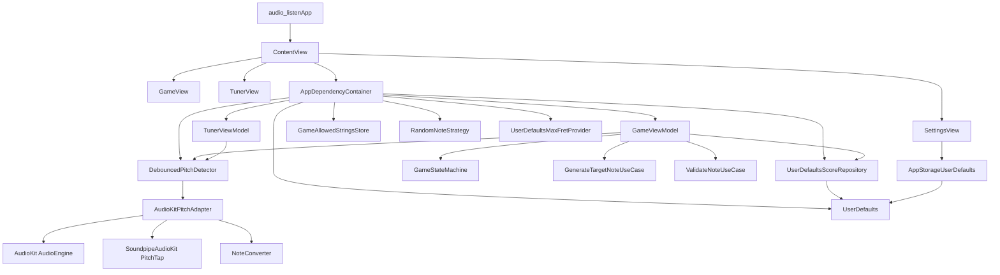

# FretBoardCrazies

`FretBoardCrazies` is a native SwiftUI guitar-training app that combines a note-finding game with a live tuner. The project is a single Xcode app target with lightweight unit and UI test targets, plus a small layered architecture that keeps UI, domain logic, and concrete audio/persistence code separate.

## Features

- `Game`: shows a **note letter + string number** while you play (no octave or fret until you get it right); after success, reveals **string + fret** (`FretPosition.displayString`). Target format is centralized in `GameTargetPrompt`. On the idle screen, **six toggles** choose which strings (1 = high E … 6 = low E) may appear; the choice is **saved in `UserDefaults`** and restored on the next launch. **Start** is disabled until at least one string is on. **Limit frets 0–12** defaults to **on** in Settings (new installs), and the generator uses that same default **before** the Settings screen has ever written the key (`UserDefaultsMaxFretProvider`). Among several valid positions for the same target note, the game **prefers the lowest fret** (`FretPositionSelection`) so targets stay easier to reach when multiple strings apply.
- `Tuner`: listens to live microphone input and shows the detected note, frequency, and signal amplitude.
- `Settings`: countdown mode, timeout duration, **amplitude threshold** (used by pitch detection), and **“Limit targets to frets 0–12”** for the game.

## Tech Stack

- `SwiftUI` for the app shell and screens
- `Combine` for pitch event streams into view models
- `AudioKit` (`5.6.5`+) and **`SoundpipeAudioKit`** (for **`PitchTap`**) via Swift Package Manager
- `AVFoundation` / `AudioEngine` for microphone input (through AudioKit)
- `Xcode` project + Apple test targets

Pitch is intended for **monophonic** use (one clear note at a time). Chords or multiple ringing strings may confuse the tracker.

## Repository Layout

```text
FretBoardCrazies/
├── audio_listen/                    # Main app source
│   ├── DI/                          # Dependency assembly
│   ├── Domain/                      # Models, protocols, use cases
│   ├── Infrastructure/              # Audio, game, and persistence implementations
│   ├── Presentation/                # SwiftUI views and view models
│   ├── Assets.xcassets/             # App assets
│   └── audio_listenApp.swift        # App entry point
├── audio_listen.xcodeproj/          # Xcode project and SwiftPM integration
├── audio_listenTests/               # Unit tests
└── audio_listenUITests/             # UI tests
```

### Layer Responsibilities

- `Presentation/` contains the `Game`, `Tuner`, and `Settings` screens plus their view models.
- `Domain/` contains app-level types such as notes, fret positions, pitch models, protocols, and game use cases.
- `Infrastructure/` contains pitch tracking (`AudioKitPitchAdapter`), note conversion, debounce logic, random note generation, and `UserDefaults` persistence.
- `DI/` contains the composition root that wires concrete implementations into the app.

## Runtime Architecture

Read the diagram from top to bottom:

- Top: app startup and tab navigation
- Middle: feature coordination in view models and use cases
- Bottom: concrete services for audio analysis and persistence

Arrow meanings depend on context:

- Creates or assembles
- Depends on
- Feeds data into



### How The Main Flows Work

#### App Shell

`audio_listenApp` launches `ContentView`, which builds a `TabView` with `GameView`, `TunerView`, and `SettingsView`. `ContentView` uses `AppDependencyContainer.shared` as the composition root for the feature view models.

#### Game Flow

`GameViewModel` coordinates the game loop:

1. Generates a target note and fret position (`RandomNoteStrategy`, using **allowed strings** from `GameAllowedStringsStore` via `AllowedStringsProviding` and **max fret** via `MaxFretProviding` / `UserDefaultsMaxFretProvider`). **Fret ≤ 12** when limiting is on, including when the key has never been written. Among candidates, `FretPositionSelection` picks the **lowest-fret** shape.
2. Moves through `idle`, `countdown`, `playing`, and `success` via `GameStateMachine`.
3. Starts microphone listening once the round begins (after optional countdown).
4. Validates detected notes against the target note (pitch class **and** octave; any string with that pitch counts as correct).
5. Saves round results (including `playedAt`) through `UserDefaultsScoreRepository`.

**Prompt copy:** While counting down or playing, the UI shows `GameTargetPrompt.playingLine` (e.g. `C string 4`). On success, the same line appears with `FretPosition.displayString` underneath so the fret is revealed.

#### Tuner Flow

`TunerViewModel` subscribes to the pitch detection pipeline and exposes:

- current note name
- detected frequency in Hz
- input amplitude
- listening state and microphone startup errors

#### Audio Signal Flow

The audio pipeline is entirely local to the app:

1. `AudioKitPitchAdapter` configures an `AudioEngine`, routes the built-in input through a **silent** `Mixer` (volume 0) so the graph runs without feeding the speaker, and attaches **`PitchTap`** (Soundpipe / pitch tracker) to the input node.
2. `PitchTap` callbacks provide per-buffer **frequency** and **amplitude** estimates (good fit for **single-note** guitar).
3. `NoteConverter` maps frequency to the nearest equal-tempered note (`A4` = 440 Hz).
4. `DebouncedPitchDetector` (~100 ms stability) emits when the same note is stable, reducing UI flicker.

**Amplitude gate**: `AudioKitPitchAdapter` reads the `minAmplitude` value from `UserDefaults` (same key as the Settings slider) on each callback so changes apply without rebuilding the dependency container.

## Data And Configuration

- Runtime settings are stored with `@AppStorage` and `UserDefaults`, not `.env` files.
- Keys include `countdownEnabled`, `timeoutSeconds`, `minAmplitude`, `limitFretsToTwelve` (shared constant `GameSettingsKeys.limitFretsToTwelve` for Settings and `UserDefaultsMaxFretProvider`), and `audio_listen_game_allowed_strings` (JSON array of string numbers 1–6 for the game string chooser).
- Game history is persisted in `UserDefaults` under the key `audio_listen_game_rounds`.
- The project uses Xcode-managed build settings and SwiftPM dependency resolution.
- The app requests microphone access and is configured for audio input in the Xcode project and entitlements.

## Development

### Requirements

- macOS with a recent Xcode install
- an Apple simulator or device with microphone support

### Open And Run

1. Open `audio_listen.xcodeproj` in Xcode.
2. Select the `audio_listen` scheme.
3. Build and run on a simulator or physical device.
4. Grant microphone permission when prompted.

Swift Package dependencies (`AudioKit`, `SoundpipeAudioKit`, and their transitive packages) should resolve automatically when the project opens.

## Testing

- `audio_listenTests` uses the Swift **`Testing`** framework with coverage for `NoteConverter`, `GuitarFretboard` (including fret caps), `ValidateNoteUseCase`, `RandomNoteStrategy.filterPositions`, `FretPositionSelection`, `UserDefaultsMaxFretProvider`, `GameAllowedStringsStore` persistence, and `DebouncedPitchDetector` (mock-backed).
- Run tests in Xcode (**Product → Test**) or `xcodebuild test` with an appropriate destination.
- `audio_listenUITests` still focuses mainly on launch coverage with `XCTest`.

## Notes

- The repository is a single app project, not a monorepo and not a frontend/backend split.
- `AudioKitPitchAdapter` is named for historical reasons; it now owns the AudioKit engine and **SoundpipeAudioKit** `PitchTap`, not a custom FFT peak detector.
