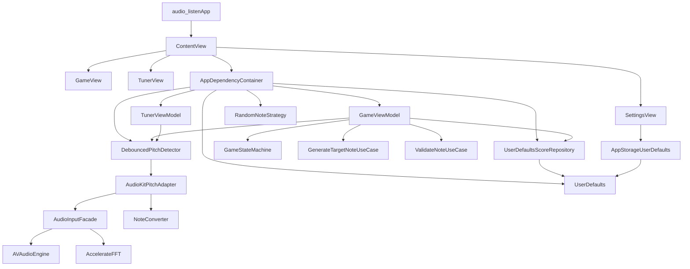

# FretBoardCrazies

`FretBoardCrazies` is a native SwiftUI guitar-training app that combines a note-finding game with a live tuner. The project is a single Xcode app target with lightweight unit and UI test targets, plus a small layered architecture that keeps UI, domain logic, and concrete audio/persistence code separate.

## Features

- `Game`: prompts the player to find a target note and fret position, starts a timed round, and tracks whether the note was played correctly.
- `Tuner`: listens to live microphone input and shows the detected note, frequency, and signal amplitude.
- `Settings`: stores game and audio preferences such as countdown mode, timeout duration, and amplitude threshold.

## Tech Stack

- `SwiftUI` for the app shell and screens
- `Combine` for pitch event streams into view models
- `AVFoundation` for microphone input
- `Accelerate` for FFT-based frequency analysis
- `Xcode` project + Apple test targets
- `AudioKit` `5.6.5` pinned through Swift Package Manager

## Repository Layout

```text
FretBoardCrazies/
├── audio_listen/                    # Main app source
│   ├── DI/                          # Dependency assembly
│   ├── Domain/                      # Models, protocols, use cases
│   ├── Infrastructure/              # Audio, game, and persistence implementations
│   ├── Presentation/                # SwiftUI views and view models
│   ├── Assets.xcassets/             # App assets
│   └── audio_listenApp.swift        # App entry point
├── audio_listen.xcodeproj/          # Xcode project and SwiftPM integration
├── audio_listenTests/               # Unit tests
└── audio_listenUITests/             # UI tests
```

### Layer Responsibilities

- `Presentation/` contains the `Game`, `Tuner`, and `Settings` screens plus their view models.
- `Domain/` contains app-level types such as notes, fret positions, pitch models, protocols, and game use cases.
- `Infrastructure/` contains microphone capture, note conversion, debounce logic, random note generation, and `UserDefaults` persistence.
- `DI/` contains the composition root that wires concrete implementations into the app.

## Runtime Architecture

Read the diagram from top to bottom:

- Top: app startup and tab navigation
- Middle: feature coordination in view models and use cases
- Bottom: concrete services for audio analysis and persistence

Arrow meanings depend on context:

- Creates or assembles
- Depends on
- Feeds data into



### How The Main Flows Work

#### App Shell

`audio_listenApp` launches `ContentView`, which builds a `TabView` with `GameView`, `TunerView`, and `SettingsView`. `ContentView` uses `AppDependencyContainer.shared` as the composition root for the feature view models.

#### Game Flow

`GameViewModel` coordinates the game loop:

1. Generates a target note and fret position.
2. Moves through `idle`, `ready`, `countdown`, `playing`, `success`, and `timeout` using `GameStateMachine`.
3. Starts microphone listening once the round begins.
4. Validates detected notes against the target note.
5. Saves round results through `UserDefaultsScoreRepository`.

#### Tuner Flow

`TunerViewModel` subscribes to the same pitch detection pipeline and exposes:

- current note name
- detected frequency in Hz
- input amplitude
- listening state and microphone startup errors

#### Audio Signal Flow

The audio pipeline is entirely local to the app:

1. `AudioInputFacade` taps the microphone with `AVAudioEngine`.
2. It computes RMS amplitude and runs an FFT with `Accelerate`.
3. `AudioKitPitchAdapter` converts raw pitch data into `DetectedPitch` values.
4. `NoteConverter` maps the dominant frequency to the nearest equal-tempered note.
5. `DebouncedPitchDetector` only emits stable note detections so UI state is less noisy.

## Data And Configuration

- Runtime settings are stored with `@AppStorage` and `UserDefaults`, not `.env` files.
- Game history is persisted in `UserDefaults` under the key `audio_listen_game_rounds`.
- The project uses Xcode-managed build settings and SwiftPM dependency resolution.
- The app requests microphone access and is configured for audio input in the Xcode project and entitlements.

## Development

### Requirements

- macOS with a recent Xcode install
- an Apple simulator or device with microphone support

### Open And Run

1. Open `audio_listen.xcodeproj` in Xcode.
2. Select the `audio_listen` scheme.
3. Build and run on a simulator or physical device.
4. Grant microphone permission when prompted.

Swift Package dependencies should resolve automatically when the project opens.

## Testing

- `audio_listenTests` exists and currently contains a placeholder test using the `Testing` framework.
- `audio_listenUITests` exists and currently contains mostly template launch coverage with `XCTest`.
- Test scaffolding is present, but automated coverage is still minimal.

## Notes

- The repository is a single app project, not a monorepo and not a frontend/backend split.
- One likely follow-up improvement: `SettingsView` persists `minAmplitude`, but the dependency container currently constructs detectors with a hardcoded `0.01` threshold.
